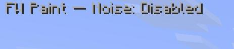

# FW Paint

A client-side [Fabric](https://fabricmc.net/) mod for **Minecraft 26.2** that paints with blocks —
build smooth **colour/brightness gradients** or fill regions with **3D noise patterns**, using the
blocks already in your inventory. It places blocks the legit, multiplayer-safe way (no cheats), so
it works on servers too.


## What it does

You mark out a region in the world, pick how blocks should be ordered (by colour, brightness, a
texture analysis, or by hand), and FW Paint fills the region for you:

- **Gradient tool** — a smooth blend from one block to another across a line/wall.
- **Noise tool** — a natural, blotchy pattern driven by a 3D noise field (great for rock, terrain,
  abstract textures).

Everything is driven from one screen (press **K**), and the blocks it uses come straight from your
hotbar/inventory.

## How it works

**1. Mark the area.** Hold your tool in **Marker** mode and click to place **start** markers
(turquoise) and **end** markers (amber). Together they bound the region you want to fill.


**2. Choose your blocks + style.** Open the screen (**K**). The left side lists the blocks from your
inventory; the right side is the settings. Pick how the gradient is ordered and tune it.

**3. Fill it.** Switch to **Place** mode and click in the marked region — the blocks get placed for
you, gradient or noise.

The little status line in the corner always tells you which tool you're holding and what it'll do:

 &nbsp;  &nbsp; 

## The gradient tool

Mark a start and end, and FW Paint orders your blocks into a smooth ramp between them. You control
how "distance" is measured (average colour, brightness, the colour of a texture's darkest/lightest
pixels, or how *different* each texture is from the start), the **curve** (ease in/out, steps),
**chaos** (how often it scatters a step for a hand-made look), and how many distinct steps to use.


The result — a clean blend from dark to light, with a touch of chaos so it doesn't look too perfect:


## The noise tool

Instead of a straight line, the noise tool samples a **3D noise field** at each block's position and
maps it onto your block order — so valleys get one end of the gradient, peaks get the other. Pick a
noise type (Smooth / Perlin / Fractal), a **seed**, and the feature **scale**, and a live preview
shows exactly which blocks will appear.


In **Place** mode, right-click flood-fills the region bounded by your markers with the noise pattern:


## Pick mode

For full manual control, set the order mode to **Pick**: select a block and press **+** / **−** to
number it. Numbered blocks (lowest → highest) become the exact sequence used — no algorithm, just
your order. Give two blocks the same number and one is chosen at random each placement.

## Keybinds & quick start

| Key | Action |
|---|---|
| **K** | Open / close the FW Paint screen |
| **G** | Cycle the held tool's mode: `Active: Marker` → `Active: Place` → `Disabled` |

1. On the **Settings** tab, set your **Gradient tool** and/or **Noise tool** to any item — the mod is
   only active while you hold that item.
2. Hold the tool, **Marker** mode (**G**), and place start (left-click) + end (right-click) markers.
3. Open the **Gradient** or **Noise Paint** tab, pick your blocks and style.
4. Switch to **Place** mode and click in the region to fill it.

Both keybinds are rebindable under Options → Controls → Key Binds → MISC.

## Build / install

```bash
./gradlew build       # -> build/libs/gradient-1.0.0.jar  (also runs tests)
./gradlew runClient   # dev Minecraft 26.2 with the mod loaded
./gradlew test        # unit tests
```

Requires **JDK 25** (Minecraft 26.2). To install into a real instance, drop
`build/libs/gradient-1.0.0.jar` into a 26.2 Fabric instance's `mods/` folder (it must already
contain Fabric API for 26.2). See `fabric-26.2-mod-starter.md` for the 26.2 API notes.

### Get a pre-built jar

- Attached to each [GitHub Release](../../releases), and to every CI run under the
  [Actions tab](../../actions) (download the `gradient-jar` artifact).
- Releases are automated: every push builds + tests, and pushing a tag like `v1.0.0` publishes a
  Release with the jar attached (`.github/workflows/build.yml`).

## Settings reference

The block list (left) shows your inventory blocks coloured by role: **white** = used, **blue** = not
picked, **green** = must-use, **red** = excluded. The four buttons assign those roles: **[S]** start,
**[E]** end, **✓** must-use, **✗** exclude. (In Pick mode they become **+ / − / ✗**.)

| Setting | What it does |
|---|---|
| **Source** | Where palette blocks come from: Hotbar / Inventory / both |
| **Gradient / Order** | How blocks are ordered: Colour, Brightness, Top-% Dark/Light (Colour or Brightness), B&W/Colour Diff, or Pick |
| **Curve** | Easing of the blend: Linear / Ease In / Ease Out / Ease In-Out / Step |
| **Deviation** | Gradient: how far a block may stray from the gradient. Noise: chance a placed block varies to a close neighbour |
| **Chaos** | Chance a placement repeats or skips a step (a hand-made, less-perfect look) |
| **Max steps** | Cap on the number of distinct blocks used |
| **Pixel %** | (Top-% modes) the fraction of each texture's pixels analysed |
| **Noise / Scale / Seed / Lock** | (Noise tool) the noise type, feature size per axis, seed, and axis lock |

Markers are saved per world + dimension; **Clear Markers** (Settings) wipes them.

## Notes

- **Placement is multiplayer-safe** — it selects/swaps the block into your hand and sends a normal
  "use on block" interaction, so the server validates it (Litematica-style). A server with anti-cheat
  may rate-limit very fast fills.
- The gradient/noise/texture maths is pure and **unit-tested** (`./gradlew test`).
